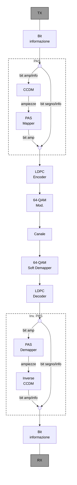

# OPTical-satellite-multi-tERAbit-communication-network-OPTERA-

```mermaid
flowchart TB

    %% ========================
    %% TX
    %% ========================
    subgraph TXROW[" "]
        direction LR

        TX["TX"]:::label
        infoTx["Bit<br/>informazione"]

        splitTx(( ))

        subgraph PASTX["PAS"]
            direction LR

            ccdm["CCDM"]
            pasMap["PAS<br/>Mapper"]
            mergeTx(( ))

            splitTx -->|"bit amp/info"| ccdm
            ccdm -->|"ampiezze"| pasMap
            pasMap -->|"bit amp"| mergeTx

            splitTx -->|"bit segno/info"| mergeTx
        end

        ldpcTx["LDPC<br/>Encoder"]
        qamTx["64-QAM<br/>Mod."]

        TX --- infoTx
        infoTx --> splitTx
        mergeTx --> ldpcTx
        ldpcTx --> qamTx
    end


    %% ========================
    %% CHANNEL
    %% ========================

    channel["Canale"]


    %% ========================
    %% RX
    %% ========================
    subgraph RXROW[" "]
        direction RL

        demap["64-QAM<br/>Soft Demapper"]
        ldpcRx["LDPC<br/>Decoder"]

        subgraph PASRX["Inv. PAS"]
            direction RL

            splitRx(( ))
            pasDemap["PAS<br/>Demapper"]
            invccdm["Inverse<br/>CCDM"]
            mergeRx(( ))

            splitRx -->|"bit amp"| pasDemap
            pasDemap -->|"ampiezze"| invccdm
            invccdm -->|"bit amp/info"| mergeRx

            splitRx -->|"bit segno/info"| mergeRx
        end

        infoRx["Bit<br/>informazione"]
        RX["RX"]:::label

        demap --> ldpcRx
        ldpcRx --> splitRx
        mergeRx --> infoRx
        infoRx --- RX
    end


    %% TX -> CHANNEL -> RX
    qamTx --> channel
    channel --> demap


    %% ========================
    %% STYLE
    %% ========================

    classDef label fill:#999999,stroke:#333333,stroke-width:1.5px,color:#000000;

    style PASTX fill:transparent,stroke:#333333,stroke-width:1.5px,stroke-dasharray:6 4
    style PASRX fill:transparent,stroke:#333333,stroke-width:1.5px,stroke-dasharray:6 4

    style TXROW fill:transparent,stroke:transparent
    style RXROW fill:transparent,stroke:transparent
```
